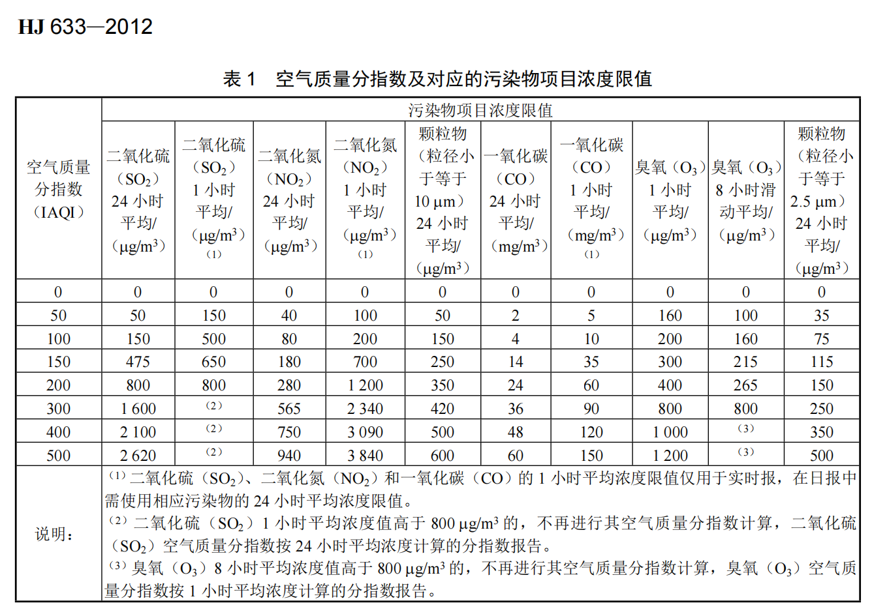
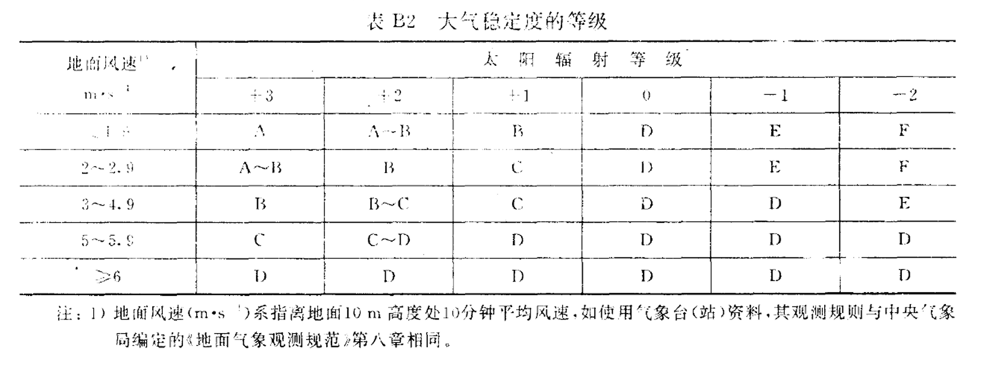
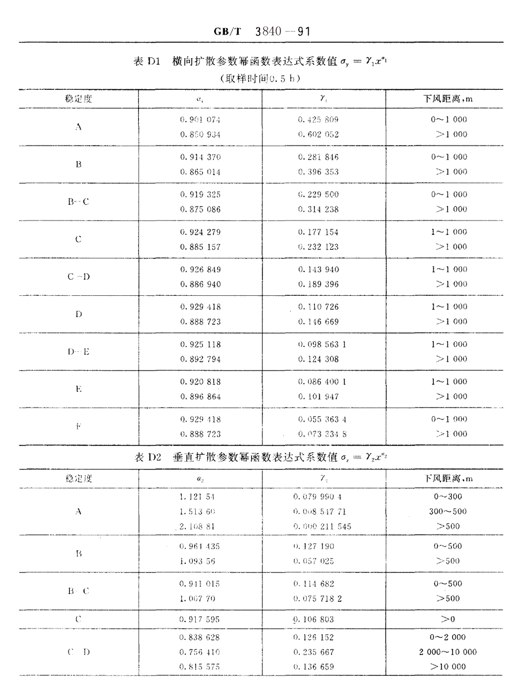
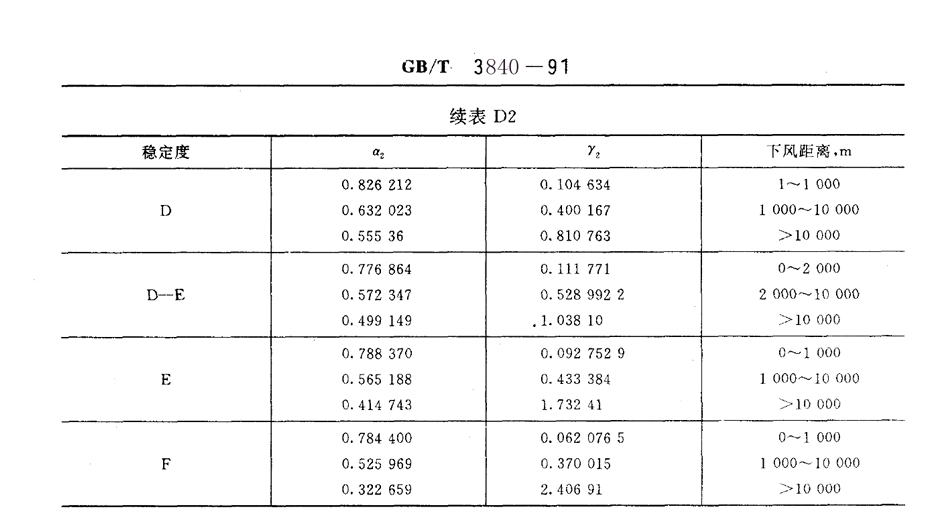

[TOC]
# 1.空气质量指数(AQI)评价模型
## (1)总结EPA AQI 和 GB 3095计算过程
### Step1：选定污染物
国标(GB3095)和美标(EPA AQI)均选定PM₂.₅, PM₁₀, O₃, CO, SO₂, NO₂
### Step2: 用线性插值公式计算IAQI
对于第 *i* 种污染物，其浓度为 $C_i$，确定其所在浓度区间 $[C_{i,\rm low},\,C_{i,\rm high}]$ 及对应AQI区间 $[I_{i,\rm low},\,I_{i,\rm high}]$（国家标准GB 3095和EPA AQI各有不同阈值）。
$$
   \text{IAQI}_i \;=\;
   \frac{I_{i,\rm high}-I_{i,\rm low}}{C_{i,\rm high}-C_{i,\rm low}}
   \,\bigl(C_i - C_{i,\rm low}\bigr)
   \;+\; I_{i,\rm low}
   $$

!!! note 
     核心假设：单污染物分指数（IAQI）计算中，污染物浓度与健康危害在分段区间内呈线性关系
  


### Step3: 计算AQI
国标和美标均采用
$$AQI = max(IAQI_i)$$
```latex
\begin{table}[htbp]
\centering
\caption{AQI 标准对照表}
\label{tab:aqi_standard}
\begin{tabular}{|c|c|c|}
\hline
\textbf{AQI范围} & \textbf{EPA描述} & \textbf{GB 3095描述} \\
\hline
0-50 & Good  & 优 \\
\hline
51-100 & Moderate  & 良 \\
\hline
101-150 & Unhealthy for Sensitive Groups  & 轻度污染 \\
\hline
151-200 & Unhealthy  & 中度污染 \\
\hline
201-300 & Very Unhealthy  & 重度污染 \\
\hline
301+ & Hazardous  & 严重污染 \\
\hline
\end{tabular}
\end{table}
```
 | AQI范围 | EPA描述    | GB 3095描述 |
 |---|---|---|
 | 0-50   | Good    | 优    |
 | 51-100  | Moderate    | 良    |
 | 101-150  | Unhealthy for Sensitive Groups| 轻度污染 |
 | 151-200  | Unhealthy    | 中度污染 |
 | 201-300  | Very Unhealthy    | 重度污染 |
 | 301+   | Hazardous    | 严重污染 |

## (2)创新与改进
GB 3095和EPA AQI均直接采用$max(IAQI_i)$作为最终AQI，网上查阅**江浙沪地区AQI**，发现基本为$PM_{2.5}$的**IAQI**，不能充分反映污染的程度.
因此，我们尝试用层次分析法AHP优化计算，为便于区分，我们将这种做法计算所得的空气质量指数称为**EAQI**
### AHP
1. **原理**
   通过构建污染物重要性判断比较矩阵，将专家知识转化为定量权重。进而综合反映各污染物对AQI的影响

2. **构造判断矩阵**  
   专家对污染物两两比较重要性（1-9标度法）

| 标度       | 含义                                      |
|------------|------------------------------------------|
| 1          | 表示两个元素相比，具有同样的重要性          |
| 3          | 表示两个元素相比，前者比后者稍重要          |
| 5          | 表示两个元素相比，前者比后者明显重要        |
| 7          | 表示两个元素相比，前者比后者极其重要        |
| 9          | 表示两个元素相比，前者比后者强烈重要        |
| 2,4,6,8    | 表示上述相邻判断的中间值                   |
| 1~9 的倒数 | 表示相应两因素交换次序比较的重要性         |
```latex
\begin{table}[htbp]
\centering
\caption{AHP 判断矩阵标度含义}
\label{tab:ahp_scale}
\begin{tabular}{|c|p{10cm}|}
\hline
\textbf{标度} & \textbf{含义} \\
\hline
1 & 表示两个元素相比，具有同样的重要性 \\
\hline
3 & 表示两个元素相比，前者比后者稍重要 \\
\hline
5 & 表示两个元素相比，前者比后者明显重要 \\
\hline
7 & 表示两个元素相比，前者比后者极其重要 \\
\hline
9 & 表示两个元素相比，前者比后者强烈重要 \\
\hline
2,4,6,8 & 表示上述相邻判断的中间值 \\
\hline
1～9 的倒数 & 表示相应两因素交换次序比较的重要性 \\
\hline
\end{tabular}
\end{table}
```
查阅资料，结合江浙沪地区实际情况，得出比较判断矩阵如下表
|         | SO₂   | CO    | NO₂   | O₃    | PM₂.₅ | PM₁₀  |
|---------|-------|-------|-------|-------|-------|-------|
| **SO₂** | 1     | 4     | 1/2   | 1/3   | 1/3   | 1/2   |
| **CO**  | 1/4   | 1     | 1/3   | 1/4   | 1/4   | 1/3   |
| **NO₂** | 2     | 3     | 1     | 1/2   | 1/2   | 1     |
| **O₃**  | 3     | 4     | 2     | 1     | 1     | 2     |
| **PM₂.₅**| 3    | 4     | 2     | 1     | 1     | 2     |
| **PM₁₀**| 2     | 3     | 1     | 1/2   | 1/2   | 1     |
```latex
\begin{table}[htbp]
\centering
\caption{比较判断矩阵}
\label{tab:aqi_matrix}
\begin{tabular}{c|cccccc}
         & SO\textsubscript{2} & CO    & NO\textsubscript{2} & O\textsubscript{3} & PM\textsubscript{2.5} & PM\textsubscript{10} \\
\hline
\textbf{SO\textsubscript{2}} & 1     & 4     & $\frac{1}{2}$   & $\frac{1}{3}$   & $\frac{1}{3}$   & $\frac{1}{2}$   \\
\textbf{CO}  & $\frac{1}{4}$   & 1     & $\frac{1}{3}$   & $\frac{1}{4}$   & $\frac{1}{4}$   & $\frac{1}{3}$   \\
\textbf{NO\textsubscript{2}} & 2     & 3     & 1     & $\frac{1}{2}$   & $\frac{1}{2}$   & 1     \\
\textbf{O\textsubscript{3}}  & 3     & 4     & 2     & 1     & 1     & 2     \\
\textbf{PM\textsubscript{2.5}} & 3    & 4     & 2     & 1     & 1     & 2     \\
\textbf{PM\textsubscript{10}} & 2     & 3     & 1     & $\frac{1}{2}$   & $\frac{1}{2}$   & 1     \\
\end{tabular}
\end{table}
```
3. **计算权重向量**  
   - 求矩阵最大特征值 \( \lambda_{\max} \) 对应的特征向量 \( W = [w_1, w_2, ..., w_n]^T \)  
   - 归一化：\( w_i = \frac{w_i}{\sum w_i} \)
  
    计算得\( \lambda_{\max}=6.154\),\(W=[0.684,0.335,1,1.780,1.780,1]^T \),归一化为\([0.104,0.051,0.152,0.271,0.271,0.152]^T\)

4. **一致性检验**  
   - 计算一致性指标 \( CI = \frac{\lambda_{\max}-n}{n-1} \)  
   - 查随机一致性指标 \( RI \)  
   - 要求 \( CR = \frac{CI}{RI} < 0.1 \)（否则调整判断矩阵）
    
    计算得\( CI=0.038\), 查表得\(RI(6)=1.24\), 则\(CR=0.0306<0.1\) 
    通过一致性检验
5. **得出权重$w_i$**
    | SO₂   | CO    | NO₂   | O₃    | PM₂.₅ | PM₁₀  |
    -------|-------|-------|-------|-------|-------|
     0.104     | 0.051     |0.152    |0.271    |0.271    | 0.152   |
### 优化结果
1. $EAQI=max(w_i*IAQI_i)$, $IAQI$加权后取最大值
2. 重新划定EAQI阈值如下：
   | EAQI范围 | EPA描述    | GB 3095描述 |
    |---|---|---|
    | 0-13.5   | Good    | 优    |
    | 13.5-27  | Moderate    | 良    |
    | 27-40.5  | Unhealthy for Sensitive Groups| 轻度污染 |
    | 40.5-54  | Unhealthy    | 中度污染 |
    | 54-81  | Very Unhealthy    | 重度污染 |
    | 81+   | Hazardous    | 严重污染 |
3. 优点：可结合实际情况（季节、政策、最新研究等）动态调整判断矩阵，进而优化各种污染物的权重，使AQI能充分反映空气污染情况.
   
# 3.单污染源空气污染扩散模型(高斯烟羽模型)
## 核心假设
  (1) 污染源(本题即为烟囱)均匀稳定连续排放污染物
  (2) 区域风向风速稳定
  (3) 污染物在水平和垂直方向上的浓度分布呈正态分布
   (4) 污染物在输送过程中质量守恒 $\newline$
大气点源污染物的实际扩散中，由于大气污染物的密度很小，地面对其有很大的反射作用。为简化问题，以下认为地面对污染物的反射系数为1，因此污染物没有耗散，满足(4)
## 核心方程
以污染点源在地面的投影为坐标原点，$x$ 轴沿风向，$y,z$ 分别为风向切向、地表水平面垂向，建立高斯模型坐标系$\newline$
$C(x,y,z,H)$ :位置 $(x,y,z)$ 的污染物浓度($mg/m^3$); ($H$为参数)
$Q$：污染物质量排放率($mg/s$);
$u$：风速($m/s$);
$H$：污染源有效高度($m$);
$\sigma_y(x),\sigma_z(x)$：横向扩散参数和垂直扩散参数($m$),随下风距离$x$而变化
$$
   C(x,y,z,H)
   = \frac{Q}{2\pi\,u\,\sigma_y(x)\,\sigma_z(x)}
     \exp\!\Bigl[-\tfrac{y^2}{2\sigma_y^2(x)}\Bigr]
     \Bigl[\exp\!\bigl(-\tfrac{(z-H)^2}{2\sigma_z^2(x)}\bigr)
          +\exp\!\bigl(-\tfrac{(z+H)^2}{2\sigma_z^2(x)}\bigr)\Bigr]
   $$
## 问题求解
### 1.初步求解
(1) 高架点源地面浓度公式，令$z=0$，得
$$
   C(x,y,0,H)
   = \frac{Q}{\pi\,u\,\sigma_y(x)\,\sigma_z(x)}
     \exp\!\Bigl[-\tfrac{1}{2}(\tfrac{y^2}{\sigma_y^2(x)}+\tfrac{H^2}{\sigma_z^2(x)})\Bigr]
   $$
(2) 在(1)的基础上，进一步令$y=0$,可得下风轴线(沿$x$轴方向)上的浓度分布公式
$$ 
    C(x,0,0,H)=\frac{Q}{\pi\,u\,\sigma_y(x)\,\sigma_z(x)}
     \exp\!(-\tfrac{H^2}{2\sigma_z^2(x)})
$$
(3) 扩散参数经验公式
   用 $Pasquill–Gifford$ 曲线拟合表达式（单位：m）：

   $$
   \sigma_y(x) = \gamma_1\,x^{\alpha_1},\quad \sigma_z(x) = \gamma_2\,x^{\alpha_2},
   $$

   其中 $(\gamma_1,\alpha_1,\gamma_2,\alpha_2)$ 依大气稳定度类别 A–F 选取。
中国国家标准GB/T 3840-91中对大气稳定度划分的规定如下：



分析查得参数应用于高斯烟羽模型

### 2.模型修正
(1)风速较小时修正
以上分析在风速$u>1.5m/s$时能得到较好的结果,但在风速$u<1.5m/s$时没有明显的风向，而且烟囱出风口处的风速可能大于$u$, 与模型的假设不符.$\newline $
此时有经验公式：
    \[ C_r = \sqrt{\frac{2}{\pi}} \frac{q}{2\pi u r\sigma_z(x)}\exp\left(-\frac{H^2}{2\sigma_z^2(x)}\right) \]
其中$C_r$表示距污染点源距离为r(单位：$m$)处的污染物浓度
  
(2)烟气抬升高度修正
烟囱排出的烟气一开始主要受到热力和动力作用上的抬升，然后才会以扩散作用为主。烟气到达一定高度后趋于稳定，此高度为烟气抬升高度，用$\Delta H$表示。

- 有风,中性或不稳定时
   ① 当烟气热释放率 \( Q_h \geq 2100 \, \text{KJ/s} \) 且 \( \Delta T \geq 35\text{K} \) 时：\[\Delta H = n_0 Q_h^{n_1} H^{n_2}/u  \quad \]
            \( \Delta H \)：烟气抬升高度（m）
            \( n_0 \)：烟气热状况及地表状况系数
            \( n_1 \)：烟气热释放率指数
            \( n_2 \)：排气筒烟气高度指数

    ② 当 \( 1700\text{KJ/s} \leq Q_h \leq 2100\text{KJ/s} \) 且 \( \Delta T \geq 35\text{K} \) 时：\[\Delta H = \Delta H_1 + (\Delta H_2 - \Delta H_1)\frac{Q_h - 1700}{400} \quad \]
    其中：\[\Delta H_1 = \frac{2(1.5V_s D + 0.01Q_h)}{U} - \frac{0.048(Q_h - 1700)}{U} \quad\]
    \( V_s \)：烟囱出口处烟气排放速度（m/s）
    \( D \)：烟囱出口直径（m）
    \( \Delta H_2 \)：按①中公式计算

    ③ 当 \( Q_h \leq 1700\text{KJ/s} \) 或 \( \Delta T < 35\text{K} \) 时：\[
    \Delta H = \frac{2(1.5V_s D + 0.01Q_h)}{U} \quad
    \]
- 有风且稳定
\[
\Delta H = Q_h^{1/3} \left(\frac{dT_a}{dZ} + 0.0098\right)^{-1/3} U^{-1/3} \quad
\]
  其中\( \frac{dT_a}{dZ} \)：烟囱几何高度以上的大气温度梯度（K/m）

- 静风和小风时
    \[\Delta H = 5.50Q_h^{1/4} \left(\frac{dT_a}{dZ} + 0.0098\right)^{-3/8} \quad\]

    - 其中\( \frac{dT_a}{dZ} \) 取值宜小于$0.01K/m$
    - 当 \( -0.0098 < \frac{dT_a}{dZ} < 0.01\text{K/m} \) 时，取 \( \frac{dT_a}{dZ} = 0.01\text{K/m} \)
    - 当 \( \frac{dT_a}{dZ} \leq -0.0098\text{K/m} \)，\( \Delta H \) 按①中计算


   


